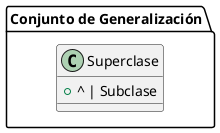

# Generalización

**Definición:** Relación taxonómica **entre una descripción general y otra más específica** que la extiende. 
  - **La descripción más específica es completamente consistente con la más general** (tiene todas sus propiedades, miembros y relaciones) y puede contener información adicional.
**Relación:** Es un "tipo de".

### Herencia

- **Mecanismo:** A través del cual los atributos, operaciones y restricciones definidas para una clase, denominada superclase, pueden ser heredados (reutilizados) por otras clases denominadas subclases.
- **Función:** Relación entre una descripción más específica y una más general, utilizada para la herencia y para declaraciones de tipo polimórfico.


![[Pasted image 20240607195411.png]]

### Propósitos de la Generalización

#### 1. Principio de Sustitución (Barbara Liskov)

- **Definición:** Definir las condiciones bajo las cuales una instancia de una clase (u otro elemento) puede ser utilizado cuando se declara una variable (como un parámetro o variable de un procedimiento) conteniendo valores de una clase dada.

- **Idea:** Cualquier instancia de una clase derivada o específica debería ser capaz de reemplazar a una instancia de la clase padre sin problemas.
- **Polimorfismo de Inclusión:** Permite que diferentes clases respondan a las mismas llamadas de método de manera diferente.

----
### Definición del Principio de Sustitución de Liskov (LSP):

**"Si S es un subtipo de T, entonces los objetos de tipo T en un programa deben poder ser reemplazados por objetos de tipo S sin alterar ninguna de las propiedades deseables de ese programa."**

En otras palabras, una clase derivada (subclase) debe ser reemplazable por su clase base (superclase) sin que el funcionamiento del programa se vea afectado. Esto significa que la subclase debe comportarse de manera coherente con las expectativas establecidas por la superclase.

### Ejemplo Práctico:

Supongamos que tenemos una clase `Animal` con un método `hacerSonido()`, y una subclase `Perro` que hereda de `Animal`.

```java
class Animal {
    void hacerSonido() {
        System.out.println("Sonido de animal");
    }
}

class Perro extends Animal {
    void hacerSonido() {
        System.out.println("Ladrido");
    }
}
```

Según el principio LSP, en cualquier lugar del programa donde se utilice un objeto de tipo `Animal`, debería ser posible utilizar un objeto de tipo `Perro` sin causar ningún problema.

```java
void hacerSonarAnimal(Animal animal) {
    animal.hacerSonido();
}

Animal miAnimal = new Animal();
Perro miPerro = new Perro();

hacerSonarAnimal(miAnimal); // Salida: Sonido de animal
hacerSonarAnimal(miPerro);  // Salida: Ladrido
```

Como se puede ver, el `Perro` se puede usar en lugar de `Animal` sin que el comportamiento del programa se vea alterado de manera negativa, cumpliendo así con el Principio de Sustitución de Liskov.

----

#### 2. Herencia

- **Definición:** Permitir la descripción incremental de un elemento que comparte las descripciones con sus antecesores.
- **Utilidad:** Facilita la reutilización de código y la organización lógica de las clases en una jerarquía.

## Notación

- **Generalización:** Se representa gráficamente con una línea sólida y una flecha abierta que apunta de la subclase a la superclase.
- **Ejemplo:**



