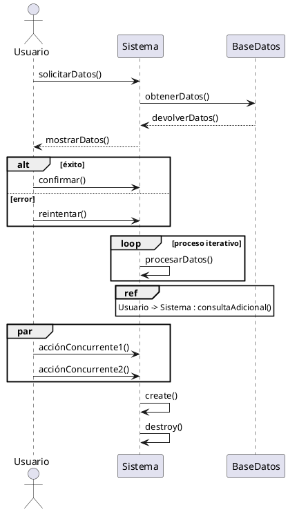

### Diagrama de Secuencia

Un diagrama de secuencia en UML es una herramienta utilizada para visualizar la interacción entre objetos en el contexto de una operación, con el tiempo representado en el eje vertical y **los roles u objetos** en el eje horizontal.

>Este tipo de diagrama es esencial para modelar el flujo de control y la comunicación entre diferentes componentes de un sistema.

#### Ejes del Diagrama

- **Eje Vertical (Tiempo)**: Representa el tiempo, que avanza de arriba hacia abajo.
- **Eje Horizontal (Roles/Objetos)**: Representa los roles u objetos individuales en la colaboración. Cada rol u objeto es representado por una columna vertical.

#### Componentes del Diagrama

1. **Línea de Vida**:
   - **Rol + Línea Discontinua**: Cada rol u objeto tiene una línea de vida que es una línea vertical discontinua. Esta línea representa la existencia del objeto a lo largo del tiempo.
   - **Símbolo de Cabecera**: El nombre del rol u objeto se coloca en la cabecera de la línea de vida.

2. **Mensaje**:
   - **Instanciación**: Se indica con una flecha punteada hacia el rol u objeto. Ejemplo: `create()`.
   - **Destrucción**: Se indica con una cruz al final de la línea de vida del objeto que deja de existir.

3. **Tipos de Mensajes**:
   - **Síncrono**: Representado con una línea sólida con una punta de flecha sólida.
   - **Asíncrono**: Representado con una línea sólida con una punta de flecha abierta.
   - **Retorno**: Representado con una línea punteada con una punta de flecha abierta.

#### Ejemplo de Diagrama de Secuencia

****

EL CREATE ES UNA DEPENDENCIA POR ESO VA CON LINEA PUNTEADA
#### Fragmentos de Interacción o Combinados

Estos fragmentos permiten modelar estructuras de control complejas dentro de un diagrama de secuencia.

1. **Operadores de Interacción**:
	   - **opt**: Opción (solo if).
	   - **alt**: Alternativa (if - else).
	   - **loop**: Bucle (iteración).
	   - **ref**: Referencia a otro diagrama de secuencia.
	   - **break**: Romper (terminar ejecución). 
	   - **par**: Paralelo (ejecución concurrente).
---
### Resumen

Un diagrama de secuencia es una herramienta poderosa para visualizar la dinámica de la interacción entre objetos en un sistema. Permite entender cómo los objetos se comunican, cómo se crean y destruyen, y cómo se controlan los flujos de ejecución complejos a través de fragmentos de interacción. Es fundamental para modelar y diseñar sistemas orientados a objetos de manera eficiente y clara.

### Ejemplo Completo de Diagrama de Secuencia

