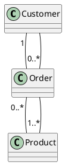

¡Por supuesto! A continuación, continúo con los apuntes y agrego ejemplos en PlantUML para ilustrar cada caso especial de asociación.

### Clase de Asociación

#### Descripción
- **Propósito**: Asignar atributos y operaciones a una asociación para hacerla única.
- **Identidad**: La asociación pasa a tener identidad.
- **Instancia Única**: Cada enlace tiene una instancia única de la clase de asociación.

### Relación Ternaria

#### Descripción
- **Diferencia**: A diferencia de la clase de asociación, las clases en una relación ternaria son independientes y no desaparecen si un enlace se borra.

### Asociación N-aria

#### Descripción
- **Navegabilidad**: No existe.
- **Multiplicidad**: Sí existe.
- **Participación**: En un enlace, todas las clases participan.
  
#### Ejemplo en PlantUML

### Asociación Calificada

#### Descripción
- **Descripción**: Ranura para un atributo o lista de atributos en una asociación binaria.
- **Implementación**: Generalmente con algún tipo de colección indizada.

###### Ejemplo

### Asociación Ordenada

#### Descripción
- **Propósito**: Reforzar la unicidad de los enlaces.

###### Ejemplo

### Asociación con Restricción

#### Descripción
- **Cobertura**: Un objeto de una clase se asocia con otro objeto de una clase u otra mediante un `xor`.

###### Ejemplo

