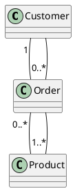
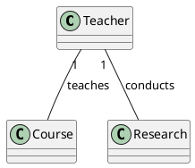

¡Por supuesto! A continuación, continúo con los apuntes y agrego ejemplos en PlantUML para ilustrar cada caso especial de asociación.

### Clase de Asociación

#### Descripción
- **Propósito**: Asignar atributos y operaciones a una asociación para hacerla única.
- **Identidad**: La asociación pasa a tener identidad.
- **Instancia Única**: Cada enlace tiene una instancia única de la clase de asociación.


### Relación Ternaria

#### Descripción
- **Diferencia**: A diferencia de la clase de asociación, las clases en una relación ternaria son independientes y no desaparecen si un enlace se borra.


### Asociación N-aria

#### Descripción
- **Navegabilidad**: No existe.
- **Multiplicidad**: Sí existe.
- **Participación**: En un enlace, todas las clases participan.
  
#### Ejemplo en PlantUML


### Asociación Calificada

#### Descripción
- **Descripción**: Ranura para un atributo o lista de atributos en una asociación binaria.
- **Implementación**: Generalmente con algún tipo de colección indizada.

#### Ejemplo en PlantUML

```plantuml
@startuml
class Company {
}

class Employee {
}

Company "1" -- {SSN} Employee : employs
@enduml
```

### Asociación Ordenada

#### Descripción
- **Propósito**: Reforzar la unicidad de los enlaces.

#### Ejemplo en PlantUML

```plantuml
@startuml
class Person {
}

class Address {
}

Person "1" -- {ordered} Address : lives at
@enduml
```

### Asociación con Restricción

#### Descripción
- **Cobertura**: Un objeto de una clase se asocia con otro objeto de una clase u otra mediante un `xor`.

#### Ejemplo en PlantUML



Estos ejemplos muestran cómo se pueden representar diferentes tipos de asociaciones especiales en UML usando PlantUML. Cada diagrama refleja los conceptos teóricos explicados previamente, facilitando su comprensión visual.