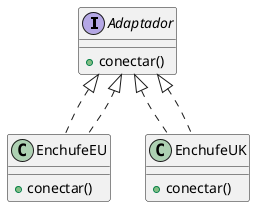
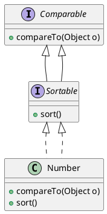
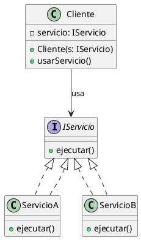
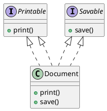

### Interfaces

#### Descripción
Una interfaz es la descripción del comportamiento de los objetos sin proporcionar su implementación o estado. 

#### Características
- **Contrato**: Las clases que implementan una interfaz deben adherirse a ella completamente, no se pueden omitir partes.
- **Métodos Abstractos**: Todos los métodos de una interfaz son abstractos, es decir, solo se proporcionan las firmas de los métodos sin su implementación.
- **Constantes**: Las interfaces pueden especificar constantes, pero no pueden tener variables de instancia.
- **Instanciación**: Una interfaz no puede ser instanciada directamente.

#### Implementación
- Una interfaz puede ser implementada por varias clases concretas que comparten comportamientos comunes.
- Cuando una clase implementa una interfaz, debe implementar todos los métodos definidos en la interfaz.
- Entre interfaces también puede haber relaciones de generalización.

#### Beneficios
- **Encapsulación**: Permite revelar la funcionalidad de un objeto sin revelar su implementación, lo cual facilita el cambio de implementación sin afectar a los usuarios de la interfaz.
- **Herencia Múltiple**: Permite imponer conjuntos múltiples de comportamientos a una clase, modelando así la herencia múltiple.
- **Desacoplamiento**: Fomenta el desacoplamiento entre las clases que usan la interfaz y las clases que la implementan.

#### Relaciones de Dependencia
- **Realización**: Entre una interfaz y una clase se habla de realización, y la flecha va desde la clase hacia la interfaz, indicando que la clase realiza (implementa) la interfaz.

### Ejemplos en PlantUML

#### Implementación de una Interfaz

#### Interfaz con Generalización

### Ejemplos de Uso y Beneficios

#### Encapsulación y Desacoplamiento
En el siguiente ejemplo, la clase `Cliente` no necesita conocer la implementación de la clase `Servicio`, solo necesita conocer la interfaz `IServicio`.

#### Modelar Herencia Múltiple
Si una clase necesita comportamientos de múltiples interfaces, puede implementarlas todas, simulando la herencia múltiple.

Estos diagramas ilustran cómo las interfaces se utilizan para definir contratos de comportamiento en UML y cómo las clases concretas pueden implementar estas interfaces para proporcionar comportamientos específicos. Además, se muestra cómo las interfaces pueden ser extendidas y utilizadas para simular herencia múltiple, promoviendo así un diseño más modular y desacoplado.