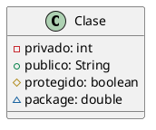

# Definiciones

## Clase
- **Definición:** Representa un concepto discreto dentro de una aplicación, modelado que representa cosas de una determinada especie.
- **Descripción:** Conjunto de objetos con estructura, comportamientos, relaciones y semántica común.
- **Ejemplos:**
  - Algo físico: avión
  - Algo del negocio: pedido
  - Un concepto lógico: horario
  - Algo de la aplicación: ventana (window), botón (button), menú
  - Algo del comportamiento: tarea, proceso

## Objeto
- **Definición:** Entidad discreta con identidad, estado y comportamiento invocable.
- **Descripción:** Instancia de una clase.
- **Composición del Objeto:** 
  - Estructura
  - Operaciones
  - Estado interno
  - Identidad
- **Estado del Objeto:** Valor de sus atributos y relaciones en un momento dado.
- **Identidad:** Esencia que lo diferencia del resto.

## Notación Gráfica de Clases

![[Pasted image 20240607193317.png]]
- **Nombre:** Una clase tiene un nombre único dentro de su contenedor (o paquete).
- **Atributos:** Propiedad con nombre.
- **Operaciones:** Implementación de un servicio.
- **Responsabilidades:** Obligación de la clase. Es opcional.

## Clases Abstractas
- **Definición de Abstracción (según OMG):** Relación que asocia dos elementos o conjuntos de elementos que representan el mismo concepto en diferentes niveles de abstracción o desde diferentes puntos de vista.
- **Descripción:** 
  - Clase que no puede ser instanciada directamente (por descripción incompleta o porque no se pretende instanciarla).
  - Operaciones abstractas son aquellas sin implementación.
  - Una clase concreta no puede tener ninguna operación abstracta.
  - Una clase abstracta puede tener operaciones concretas que pueden ser compartidas por todas las subclases.
  - Un caso de uso abstracto define un fragmento de comportamiento que puede ser utilizado en la definición de casos de uso concretos (mediante relaciones de inclusión o extensión).
- **Beneficios:** Al agrupar el comportamiento común, el modelo se simplifica y resulta más comprensible.
- **Notación:** `« abstract »`.

![[Pasted image 20240607194547.png]]

## Clases: Niveles de Visibilidad

**Visibilidad**: especifica si el elemento de un objeto de una clase puede ser usado o accedido por otro objeto de otra clase. Ayuda a definir el nivel de encapsulamiento.

- **Protegido** (#): La propia clase y los hijos
- **Público** (+)
- **Privado** (-)
- **Paquete** (~): Empaqueta dos clases y ambas pueden acceder a estos métodos

---

## Diagramas de Clases y Objetos

Un diagrama de una instantánea es una imagen del sistema en un instante en el tiempo. Dado que contiene imágenes de objetos, se denomina diagrama de objetos. Se asocia un diagrama de objetos a uno de clases.

Arriba el diagrama de clases, abajo el diagrama de objetos en un instante donde existen dos clientes de un banco. Aquí se puede apreciar que la cardinalidad dada en el diagrama de clases se cumple con respecto al diagrama de objetos.

---

## Pequeño Resumen
- **Clases** representan conceptos y agrupan objetos con características y comportamientos comunes.
- **Objetos** son instancias de clases, tienen identidad, estado y comportamiento.
- **Clases Abstractas** definen comportamientos y estructuras comunes pero no pueden ser instanciadas directamente.

---
