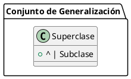

# Generalización

- **Definición:** Relación taxonómica entre una descripción general y otra más específica que la extiende. 
  - La descripción más específica es completamente consistente con la más general (tiene todas sus propiedades, miembros y relaciones) y puede contener información adicional.
- **Relación:** Es un "tipo de".

### Herencia

- **Mecanismo:** A través del cual los atributos, operaciones y restricciones definidas para una clase, denominada superclase, pueden ser heredados (reutilizados) por otras clases denominadas subclases.
- **Función:** Relación entre una descripción más específica y una más general, utilizada para la herencia y para declaraciones de tipo polimórfico.

![[Pasted image 20240607195411.png]]

### Propósitos de la Generalización

#### 1. Principio de Sustitución (Barbara Liskov)

- **Definición:** Definir las condiciones bajo las cuales una instancia de una clase (u otro elemento) puede ser utilizado cuando se declara una variable (como un parámetro o variable de un procedimiento) conteniendo valores de una clase dada.
- **Idea:** Cualquier objeto de una clase derivada o específica debería ser capaz de reemplazar a una instancia de la clase padre sin problemas.
- **Polimorfismo de Inclusión (Sobrecarga):** Permite que diferentes clases respondan a las mismas llamadas de método de manera diferente.

#### 2. Herencia

- **Definición:** Permitir la descripción incremental de un elemento que comparte las descripciones con sus antecesores.
- **Utilidad:** Facilita la reutilización de código y la organización lógica de las clases en una jerarquía.

## Notación

- **Generalización:** Se representa gráficamente con una línea sólida y una flecha abierta que apunta de la subclase a la superclase.
- **Ejemplo:**

